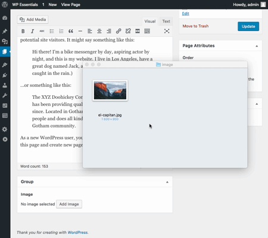
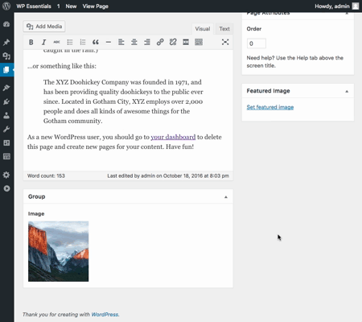

# Advanced Custom Fields: Drop Files on Fields

Drop files directly on ACF fields that accept files (types: image, gallery and file).

### Compatibility

Compatible with:
* ACF 5 (aka ACF Pro)

### Installation

1. Copy the `acf-drop-files-on-fields` folder into your `wp-content/plugins` folder
2. Activate the Advanced Custom Fields: Drop Files on Fields plugin via the plugins admin page
3. Manage which type of fields to enable as drop targets on the settings page (Custom Fields > Drop Files on Fields)
